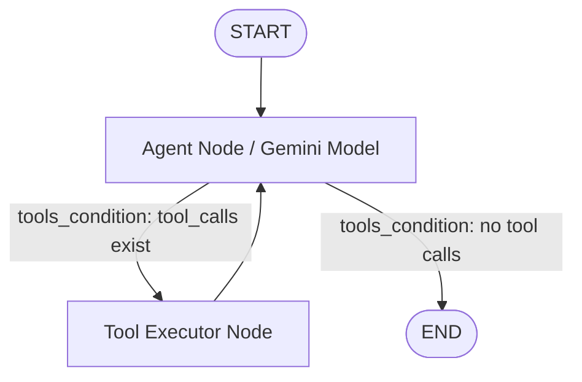

# LangGraph Research & AI Agent Studio Design Specification

**Date:** 2026-09-06  
**Status:** Approved  
**Target Frameworks:** LangGraph, LangChain Google GenAI (`gemini-2.5-flash`), Streamlit  

---

## 1. Executive Summary
The **LangGraph Research & AI Agent Studio** is a dual-purpose application designed to:
1. Provide an autonomous **Research & Learning AI Agent** capable of searching the web, analyzing documentation, and generating structured tutorials and runnable Python code.
2. Serve as an interactive **Educational Blueprint** that teaches developers how to build, inspect, and master LangGraph architecture (State, Nodes, Edges, Tool Binding, Checkpointers/Memory).

---

## 2. File & Component Structure

```text
c:\Yash College\New folder (2)\
├── .env                      # Environment variables (GOOGLE_API_KEY)
├── requirements.txt          # Python package requirements
├── agent/
│   ├── __init__.py
│   ├── state.py              # AgentState definition using TypedDict & add_messages
│   ├── tools.py              # Web search, doc reader, and python evaluator tools
│   ├── graph.py              # StateGraph builder, node definitions, tools_condition, MemorySaver
│   └── tutorial_content.py   # Catalog of LangGraph concepts and code examples
├── app.py                    # Streamlit Multi-Tab Interactive Dashboard
└── main.py                   # Command-line interface runner for quick testing
```

---

## 3. LangGraph Agent Architecture

### 3.1 State Definition (`agent/state.py`)
```python
from typing import TypedDict, Annotated
from langchain_core.messages import AnyMessage
from langgraph.graph.message import add_messages

class AgentState(TypedDict):
    messages: Annotated[list[AnyMessage], add_messages]
    research_topic: str
    status: str
```

### 3.2 Tools (`agent/tools.py`)
1. `web_search(query: str) -> str`: Performs live internet search using DuckDuckGo to fetch documentation, articles, and research.
2. `fetch_web_page(url: str) -> str`: Scrapes and extracts readable text from specific documentation links.
3. `evaluate_python_code(code: str) -> str`: Safely parses and validates Python code syntax for generated LangGraph snippets.

### 3.3 Graph Nodes & Routing (`agent/graph.py`)
* **`agent_node`**: Passes full message history to `ChatGoogleGenerativeAI(model="gemini-2.5-flash")` configured with `.bind_tools([web_search, fetch_web_page, evaluate_python_code])`.
* **`tool_node`**: Native `ToolNode` from `langgraph.prebuilt`.
* **Routing**: Uses `tools_condition` to route conditionally from `agent_node` to `tool_node` when `tool_calls` are present, or to `END` when the final answer is compiled.
* **Persistence**: Compiles with `MemorySaver()` checkpointer allowing state retrieval and conversation memory by `thread_id`.



---

## 4. User Interface Specification (`app.py`)

### 4.1 Sidebar Controls
* **Session Manager**: Thread selector dropdown + "New Session" button.
* **API Key Status Check**: Validates `GOOGLE_API_KEY` presence.
* **Quick Prompt Shortcuts**: One-click research prompts ("Explain LangGraph Checkpointers", "Compare LangGraph vs AutoGen", "Show Subgraph Example").

### 4.2 Tab 1: 💬 Research & Coding Assistant
* Interactive Chat log displaying human messages and assistant responses.
* Expandable **Graph Step Execution Trace** showing when nodes (`agent`, `tools`) execute and which tools were invoked.
* Markdown-formatted research reports, tutorial guides, and syntax-highlighted python code blocks.

### 4.3 Tab 2: 🔍 Graph Inspector & Visualization
* Graphical representation of the compiled `StateGraph`.
* Live inspection of current `AgentState` JSON and checkpointer history logs.

### 4.4 Tab 3: 📚 LangGraph Masterclass Guide
* Embedded interactive learning module covering:
  - Core concepts: State, Nodes, Edges, Conditional Edges.
  - Memory & Checkpointing with `MemorySaver`.
  - Tool Binding with `ChatGoogleGenerativeAI`.
  - Copyable code snippets with annotations.

---

## 5. Verification & Testing Plan
* **API Verification**: Test `ChatGoogleGenerativeAI` initialization with Gemini 2.5/1.5 models using `GOOGLE_API_KEY`.
* **Graph Logic Test**: Execute `main.py` CLI to verify tool binding, state updates, and memory checkpointer state transitions.
* **Dashboard Verification**: Run `streamlit run app.py` and verify all tabs, chat streaming, and graph visualizations render cleanly.
